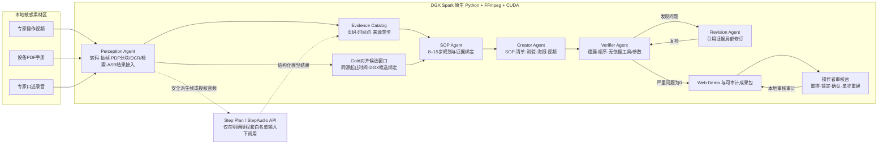

# SkillForge 架构与数据边界

## 1. P0架构



P0主链路不依赖Docker。DGX使用原生Python虚拟环境、用户级FFmpeg和可审计CUDA内核；只有确定部署本地GPU模型或NVIDIA VSS时才处理Docker权限。

## 2. 五类Agent职责

| Agent | 输入 | 输出 | 不能做的事 |
|---|---|---|---|
| Perception | 视频、PDF、录音或安全派生数据 | 带页码和时间点的Evidence | 不把视觉候选自动当作设备事实 |
| SOP | Evidence与约束 | 8–15步候选SOP、依赖和证据绑定 | 不补写无来源工具、参数或安全承诺 |
| Creator | 已绑定证据的SOP | 清单、测验、海报、培训视频 | 不脱离Gold改变必要/条件步骤 |
| Verifier | 草稿、规则、Evidence | 缺失、顺序、工具、参数等冲突 | 不直接覆盖人工Gold |
| Revision | 冲突和引用证据 | 受影响字段的局部修订及审计 | 不整包无差别重写 |

## 3. 数据分级

| 级别 | 示例 | Git | 外部API | 公开演示 |
|---|---|---:|---:|---:|
| 私有原始素材 | 原片、厂商手册原件、专家录音、真实面单、私有照片 | 禁止 | 默认禁止 | 禁止 |
| 安全派生素材 | 已遮挡视频、经检查关键帧、授权音频 | 禁止 | 需逐项授权 | 只使用审核通过版本 |
| 结构化证据 | Evidence ID、PDF页码、视频/录音时间点、来源类型 | 允许脱敏版本 | 可按任务最小化发送 | 允许 |
| 可公开成果 | Gold摘要、SOP、清单、测验、海报、培训视频、评测报告 | 允许 | 无需再次发送 | 允许 |
| 凭证 | `.env`、API Key、Authorization Header | 禁止 | 仅请求过程使用 | 禁止 |
| 本地审核会话 | 步骤顺序、锁定/确认状态、单步重建次数和操作者事件 | 禁止 | 禁止 | 仅现场会话展示 |

## 4. 事实与模型边界

- Gold事实来自设备手册、连续视频引用和实际操作者审核；模型输出不会覆盖Gold。
- DGX CUDA结果只用于亮度、对比度、边缘和场景变化候选筛选，不能表述为语义理解结论。
- 连续动作窗口只合并已经过Gold步骤对齐和视觉复核的同源时间区间，范围为 `GOLD_ALIGNED_CANDIDATE_WINDOW_ONLY`；不能表述为无Gold引导的通用动作识别。
- PDF正文、页面图和检索索引保持在本地Git忽略目录；公开PDF结构报告只保留输入哈希、结构计数、OCR状态和命中页码。
- 结构化Gold现场重算约45毫秒，不包含视频、PDF、录音预处理，也不是GPU推理速度。
- Step 3.7规划和视觉复核当前通过Step Plan API完成，不能宣称全部模型均在DGX本地运行。
- 第三方售后教程只作本地参考；厂商手册原件和真实面单不重新分发。
- Evidence定位接口只返回结构化页码或时间点；视频可关联已审核成片预览，但 `raw_source_url` 固定为空。审核会话目录700、文件600，位于Git忽略的 `outputs/` 下。

## 5. 运行与降级

```text
现场优先：DGX用户服务 + SSH隧道 + 结构化Gold现场重算
       ↓ 失败
本机预处理：安全派生素材 + 原生Python/FFmpeg
       ↓ 失败
离线兜底：仓库内无原始素材的Gold演示包 + PPT + 有声录屏
```

关键命令：

```bash
.venv/bin/python -m pytest
bash scripts/check_pitch.sh
bash scripts/check_submission.sh
bash scripts/dgx_demo_tunnel.sh --smoke
```

`check_submission.sh`只有在Git工作树干净、自动测试和安全检查通过时，才可能进入 `READY_WITH_HUMAN_GATES`；团队资格、官方规则、完整观看、真人彩排和最终录屏仍必须由参赛者确认。五项全部关闭后才进入 `READY_FOR_SUBMISSION` 并返回成功码。
