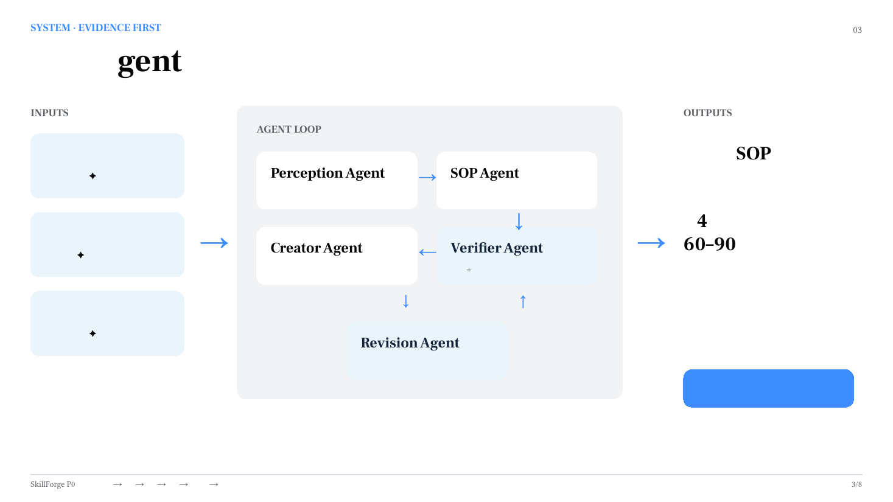
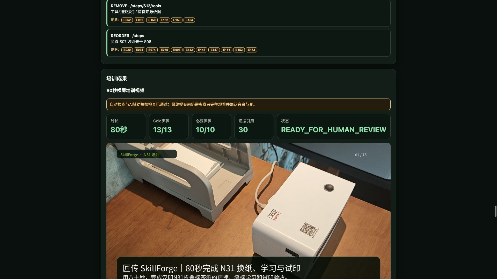
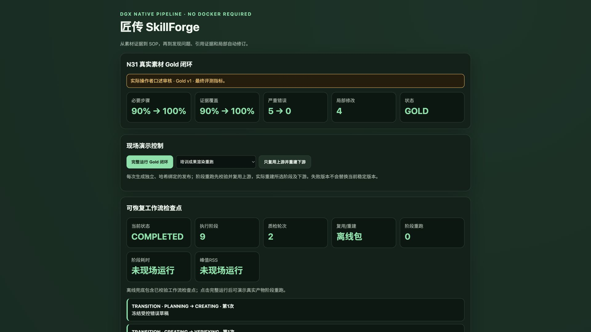

# 给AI划边界，比写prompt重要一百倍

> SkillForge 方法论系列 03/05 · 星星之火 · NVIDIA DGX SPARK 黑客松 2026

## 一个让人崩溃的循环

你用AI生成了一份培训教程。读起来挺顺，排版也好看。但你不敢直接用——因为你知道里面可能有编的内容。

于是你逐句核实。第3步说"将导纸夹调至75mm"——手册上写的是72mm。第7步说"等待指示灯闪烁5次"——视频里明明是闪3次。第11步提到一个"校准螺丝"——翻了整本手册，根本没有这个东西。

你改了这三处，松了口气。但转念一想：我只发现了三处，还有没有我没发现的？13个步骤，每步四五个细节，你真的能逐条验证完吗？

下次你换了个prompt，加了句"请严格按照我提供的材料生成，不要编造"。AI确实收敛了一些，但你还是不敢不核实。因为"不要编造"是个软约束——模型可能"不小心"就补了一个看起来合理的参数。

这个循环的本质是：**你在用人工审核来弥补系统设计的缺陷。**

## 方法论：约束即自由

SkillForge 的 Creator Agent 有一条铁律，不是写在prompt里的，是写在代码里的：

*五类Agent协作：Perception→SOP→Creator→Verifier→Revision*

**只能使用当前步骤已绑定的证据。不能为了"读起来更顺"而添加任何没有来源的内容。**

如果某步证据不足，Creator 会输出"待补充"标记，而不是编一个看起来合理的说法。宁可留白，不可编造。

这不是prompt engineering，是系统架构层面的硬约束。模型输出的每个字段——工具名、参数值、警告语、完成标准——都要通过一个验证器：这个值在当前步骤的Evidence列表里有没有对应来源？没有就拒绝，不管模型觉得它"应该有"。

听起来这是在限制AI？恰恰相反。

正因为有了这个边界，生成的内容你不需要逐句核实——因为系统已经替你核实过了。没有来源的句子根本不会出现在成品里。你的审核工作从"逐句验证对不对"变成了"看看哪些步骤标记了待补充"。

**省下的审核时间，才是AI真正帮你省的时间。** 不是生成快了3秒，是审核少了40分钟。

## 一份SOP长出五种成品

有了证据约束的13步SOP，Creator Agent 自动生成五种不同形态的培训材料：

**手机检查清单（13项）：** 新员工拿着手机对着打印机走一遍，每步打勾确认。不需要记住所有细节，跟着清单做就行。适合"第一次上手"的场景。

**培训测验（5题）：** 每道题绑定对应步骤和证据来源。答错了不只是告诉你"错了"，还告诉你"去看手册第几页、视频第几秒"。适合"确认学会了"的场景。

**A4培训海报：** 一页纸贴在设备旁边，关键步骤和警告一目了然。换纸前扫一眼，不用翻手册。适合"日常提醒"的场景。

**80秒培训视频：** 15个镜头覆盖全部13个步骤，绑定25条去重Evidence。有旁白、有画面、有时间定位。适合"入职培训"的场景。

**三种SOP视图：** 完整版供存档、精简版供现场、带证据版供审核。不同角色看不同版本。

注意：这不是"用AI多写了几篇文章"。是同一份可信知识，适配了五种不同的使用场景。站着看海报，走着看手机，坐着看视频，考试看测验。知识只有一份，形态跟着场景走。

## 为什么"自由发挥"的AI反而不好用

很多人觉得AI的价值在于"创造力"——让它自由发挥，写出人类想不到的东西。

*同一份SOP自动生成五种培训成品*

在营销文案、创意写作领域，这没问题。但在培训内容、操作手册、安全规程这些领域，"创造力"恰恰是最危险的东西。

模型"创造"一个不存在的参数，你最多浪费时间核实。模型"创造"一个不存在的安全警告，你可能忽略真正的风险。模型"创造"一个不存在的工具名，新手可能对着设备找半天找不到。

在知识密集型内容生产里，**约束不是限制，是保护。** 保护你的读者不被看似合理但实际错误的信息误导。保护你的审核者不需要逐句验证。保护你的培训体系不会因为一次AI生成而引入新的不确定性。

## 视频不是"配个画面"

80秒培训视频的制作过程也遵循同样的约束。15个镜头，每个镜头对应具体的Gold步骤，画面来源只能是安全派生视频片段、手册页面渲染或文字动画。旁白由TTS生成，节奏与画面同步。

自动QA检查：时长范围、编码格式、步骤覆盖率、证据绑定数、来源策略合规。最终提交前保留人工完整观看和隐私复核——机器不能替人签字。

这是"约束即自由"的另一面：该让机器做的让机器做（生成、拼接、编码），该让人确认的必须人来确认（内容正确性、隐私合规、最终发布）。

## 你能带走的

用AI做任何内容生产时，**先定义"不能做什么"，再定义"要做什么"。**

*SkillForge Web演示：从证据到成品的完整链路*

具体操作：

1. 列出"禁止清单"：不能引用不存在的来源、不能为了流畅添加未验证信息、不能把"模型觉得对"当成事实
2. 把禁止清单变成系统约束，而不是prompt里的一句话。Prompt是软约束，代码是硬约束
3. 设计"留白机制"：信息不足时输出"待补充"标记，而不是让模型猜
4. 审核时只看"待补充"和"覆盖不足"的标记，不需要逐句验证
5. 同一份核心知识，适配多种输出形态——不要为每种形态重新生成

划好边界，AI的输出才从"需要人工逐句审"变成"可以直接用"。这才是真正的效率提升。

---

*SkillForge（匠传）· 团队：星星之火 · NVIDIA DGX SPARK 黑客松 2026*
*代码：github.com/sparklefire/SkillForge*
*下一篇：《改作文最蠢的做法：把整篇撕了重写》——局部修订方法论*
